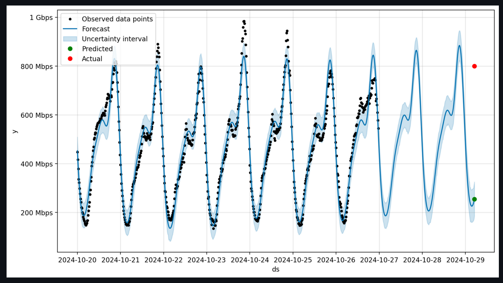
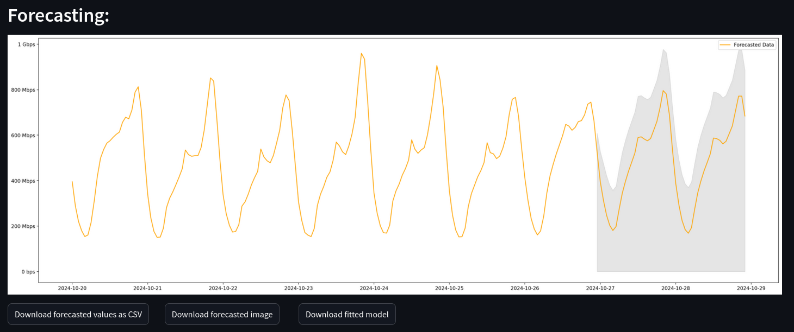
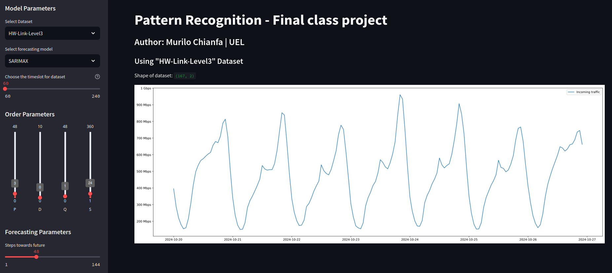
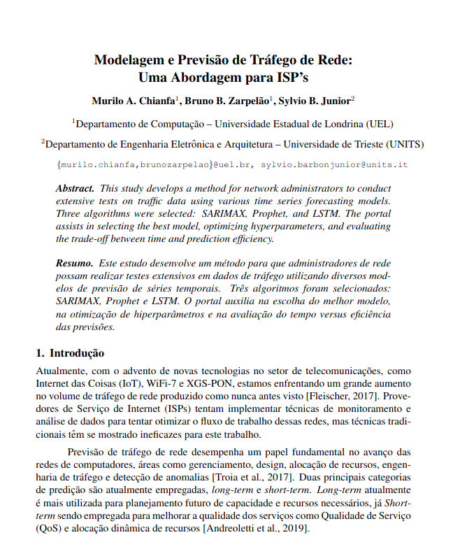

<h1 align="center"> Network Traffic Time Series Forecasting </h1>

> Predict the future of your network using the best time series ML model that fit with your traffic.

- You can try with your own data builded from raw netflow.
- Fork this project to your Github account.
- This software is created under [MIT License](https://github.com/MuriloChianfa/network-traffic-time-series-forecasting/blob/main/LICENSE)

## Facebook Prophet network traffic forecasting



## SARIMAX network traffic forecasting



## ML model fitting



<hr>

# Written paper

> [!IMPORTANT]
>
> The following work and its results are the result of a project presented at the end of the subject of the pattern recognition class of the Master's in Science course Computing at the State University of Londrina (UEL) and does not have the objective of being published as a scientific article.

You can read the [written paper](network-traffic-time-series-forecasting.pdf) here, please notice to the above advice.



# Install instructions

We've some methods to get up and running the application:

<details open>
  <summary style="font-size: 20px;"><strong>Using pure Python</strong></summary>

  ### Dependencies

  - *Python v3.11.10.*

  #### 1° - Clone the project

  ```bash
  git clone git@github.com:MuriloChianfa/network-traffic-time-series-forecasting.git
  cd network-traffic-time-series-forecasting
  ```

  #### 2° - Install dependencies into a new virtual environment

  ```bash
  virtualenv -p python3.11 venv
  . ./venv/bin/activate
  pip install -r requirements.txt
  ```

  #### 3° - Running the application

  ```bash
  streamlit run forecasting/main.py
  ```

  #### 4° - Access the application

  [http://localhost:8501](http://localhost:8501)
</details>
<details>
  <summary style="font-size: 20px;"><strong>Using Docker Compose</strong></summary>

  ### Dependencies

  - *Docker v24.0 or higher.*
  - *Docker Compose v2.13 or higher.*
  - *Your may need nvidia-container-toolkit.*

  #### 1° - Clone the project

  ```bash
  git clone git@github.com:MuriloChianfa/network-traffic-time-series-forecasting.git
  cd network-traffic-time-series-forecasting
  ```

  #### 2° - Running project

  ```bash
  docker compose -f docker-compose.yml up -d
  ```

  #### 3° - Access the application

  [http://localhost](http://localhost)
</details>
<details>
  <summary style="font-size: 20px;"><strong>Building your own dataset</strong></summary>

  #### 1° - Preparing go modules

  ```bash
  cd preprocess
  go mod init network-traffic-time-series-forecasting
  go mod tidy
  go env -w GO111MODULE=on
  go get github.com/phaag/go-nfdump@d2ff6042cb5186ede4064cbd50253ab97a78a89e
  ```

  #### 2° - Running traffic extractor

  ```bash
  go run extract-traffic.go
  ```
</details>
